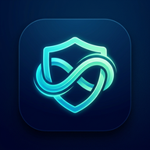
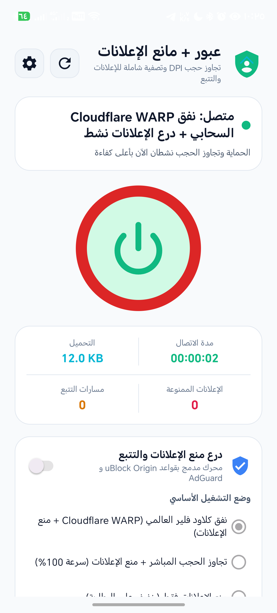
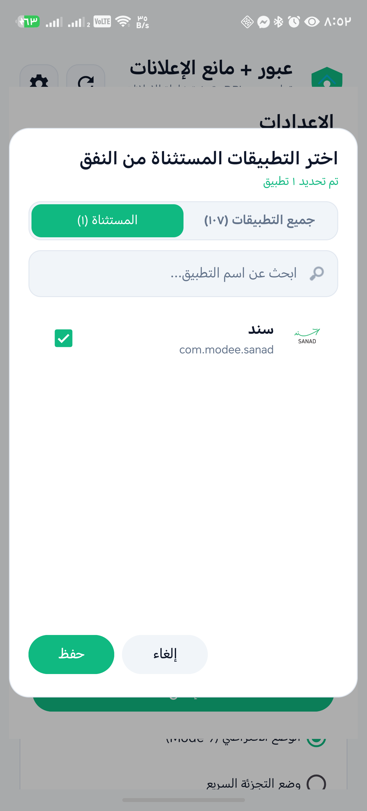
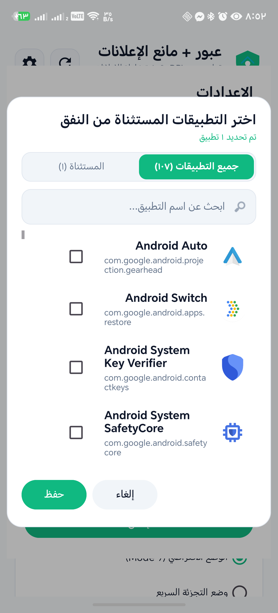
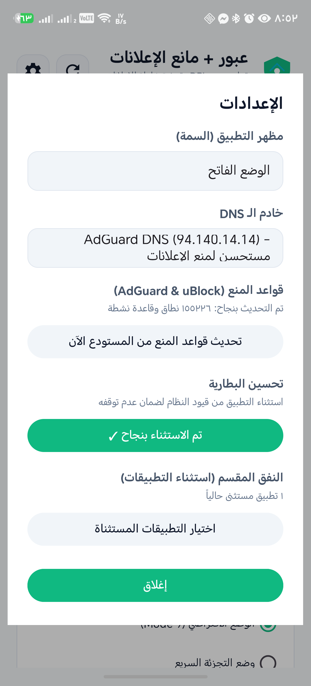

<div align="center">



# Ubour (عبور)
### Next-Generation Anti-Censorship & Local AdBlock Suite for Windows & Android

[](LICENSE)
[](https://github.com/mohammedjaferalshouha/ubour-vpn/actions/workflows/build_release.yml)
[](https://github.com/mohammedjaferalshouha/ubour-vpn/actions/workflows/security_scan.yml)
[](#-android-application)
[](#-windows-pc-application)
[](#-privacy--security)
[](https://htmlpreview.github.io/?https://github.com/mohammedjaferalshouha/ubour-vpn/blob/main/graphify-out/graph.html)

**[English](README.md) | [العربية (Arabic)](README.ar.md)**

<br/>

### ⚡ One-Click Direct Downloads (تحميل مباشر بنقرة واحدة)

[-3DDC84?style=for-the-badge&logo=android&logoColor=white)](https://github.com/mohammedjaferalshouha/ubour-vpn/releases/latest/download/Ubour-VPN-Release.apk)
[-0078D6?style=for-the-badge&logo=windows&logoColor=white)](https://github.com/mohammedjaferalshouha/ubour-vpn/releases/latest/download/Ubour-windows-x64.zip)
[-5C2D91?style=for-the-badge&logo=windows&logoColor=white)](https://github.com/mohammedjaferalshouha/ubour-vpn/releases/latest/download/Ubour-windows-x86.zip)
[](https://htmlpreview.github.io/?https://github.com/mohammedjaferalshouha/ubour-vpn/blob/main/graphify-out/graph.html)
[](https://github.com/mohammedjaferalshouha/ubour-vpn/releases)

</div>

---

## 📖 Overview

**Ubour (عبور)** is a high-performance, open-source censorship circumvention and network privacy suite engineered for **Android** and **Windows PC**. 

Unlike conventional VPN services that route all your internet traffic through external third-party proxy servers (introducing latency, bandwidth caps, and privacy risks), **Ubour** operates **directly on your device**:
- **Censorship Circumvention**: Manipulates and segments TCP/TLS packets and HTTP headers at the socket/kernel level to evade Deep Packet Inspection (DPI) censorship systems deployed by Internet Service Providers (ISPs).
- **Built-in Local Ad & Tracker Blocker**: Integrates over 180,000+ full rule lists from **uBlock Origin** and **AdGuard**, filtering unwanted advertisements and telemetry locally before they leave your device.
- **Independent DNS & Privacy**: Pure direct connection with neutral DNS resolvers (Google DNS 8.8.8.8, Quad9 9.9.9.9, AdGuard DNS 94.140.14.14) without forcing intermediary proxies.
- **Isolated Cloudflare WARP & VLESS Reality Support**: Optional dedicated tunnels for specialized censorship environments when explicitly chosen.
- **Native Full Speeds**: Zero server overhead ensures 100% of your native ISP bandwidth and minimal latency.

---

## 📸 Screenshots Showcase

<div align="center">
<table>
  <tr>
    <td align="center" width="25%"><b>Main Interface (Connected)</b></td>
    <td align="center" width="25%"><b>Split Tunneling (Excluded)</b></td>
    <td align="center" width="25%"><b>All Apps & Search</b></td>
    <td align="center" width="25%"><b>Settings & Optimization</b></td>
  </tr>
  <tr>
    <td></td>
    <td></td>
    <td></td>
    <td></td>
  </tr>
</table>
</div>

---

## 🌟 Key Features

### 📱 Android Application (`apk+ublock`)
* **Integrated Native ByeDPI Engine**: Real-time TCP segmentation, SNI fragmentation, and fake packet injection.
* **Local Ad & Tracker Shield**: Over 180,000+ active blocking rules compiled from uBlock Origin and AdGuard.
* **Split Tunneling with Tabs & Live Search**:
  * Easily exclude sensitive applications (e.g., Banking apps, government portals like Sanad) to connect directly.
  * Dedicated tabs: **All Apps** and **Excluded Only** with instantaneous real-time search.
* **Battery Optimization Intelligence**: Automated detection and status indicator for background process stability.
* **Independent DNS Engine**: Fully decoupled DNS resolution defaulting to standard Google DNS (8.8.8.8 / 8.8.4.4), Quad9 (9.9.9.9 / 149.112.112.112), and AdGuard DNS.
* **4 Operation Modes**:
  1. *Direct DPI Bypass (100% Speed)*: Pure direct connection without proxy overhead.
  2. *Direct Bypass + AdBlock*: Full DPI evasion + local ad & tracker filtering.
  3. *AdBlock Only*: Ultra-light battery saver mode for pure local ad blocking.
  4. *Cloudflare WARP + AdBlock*: Full encrypted tunnel via Cloudflare WARP.
* **Custom VLESS Reality Support**: Built-in Sing-box core supporting direct VLESS Reality custom endpoints.
* **Upstream Updates Center**: Live checking and one-click rules update against official upstream repositories.
* **Cryptographically Signed**: Official production keystore with Android V2/V3 signature schemes for seamless OTA updates.
* **Modern Material 3 Interface**: Elegant Dark/Light mode with comprehensive Arabic (RTL) & English localization.

### 💻 Windows PC Application (`windows/src/Ubour`)
* **GoodbyeDPI & WinDivert Integration**: Kernel-level packet filter bypassing ISP DPI with zero latency.
* **Multi-Preset DPI Selector**: Quick switching between Standard Mode, Fast Fragmentation, and Fake SNI.
* **Lightweight WPF Interface**: Clean Arabized GUI with system tray minimization and auto-reconnect.
* **Built-in Auto Updater**: Seamless one-click verification against GitHub releases.
* **x64 & x86 Dual Architecture**: Native standalone publish packages.

---

## 📦 Direct Downloads & Packages Table

| Platform | Direct Download Link | Architecture | Type |
| :--- | :--- | :--- | :--- |
| **Android APK** | [📥 **Download APK**](https://github.com/mohammedjaferalshouha/ubour-vpn/releases/latest/download/Ubour-VPN-Release.apk) | `arm64-v8a`, `armeabi-v7a`, `x86_64`, `x86` | Universal Signed Release APK |
| **Windows x64** | [📥 **Download Win x64**](https://github.com/mohammedjaferalshouha/ubour-vpn/releases/latest/download/Ubour-windows-x64.zip) | `x64` (64-bit) | Standalone Executable (Win 10/11) |
| **Windows x86** | [📥 **Download Win x86**](https://github.com/mohammedjaferalshouha/ubour-vpn/releases/latest/download/Ubour-windows-x86.zip) | `x86` (32-bit) | Standalone Executable (Win 7/8/10/11) |
| **Previous Releases** | [📚 **View All Releases**](https://github.com/mohammedjaferalshouha/ubour-vpn/releases) | All Platforms | Full Release Archive & History |

---

## 🛠️ Build & Test Instructions

### Android App
```bash
# Clone the repository
git clone https://github.com/mohammedjaferalshouha/ubour-vpn.git
cd ubour-vpn/apk+ublock

# Run unit tests and lint checks
./gradlew test lint

# Build signed release APK
./gradlew assembleRelease
```
The output APK is located at: `app/build/outputs/apk/release/app-release.apk`

### Windows PC App
```bash
cd ubour-vpn/windows/src

# Run unit tests
dotnet test Ubour.Tests/Ubour.Tests.csproj -c Release

# Publish Windows application
dotnet publish Ubour/Ubour.csproj -c Release -r win-x64 --self-contained false
dotnet publish Ubour/Ubour.csproj -c Release -r win-x86 --self-contained false
```

---

## 🔒 Privacy & Security

- **Zero Logging**: Ubour does not log, collect, or transmit any user browsing activity, IP addresses, or DNS queries.
- **Client-Side Processing**: All packet manipulation and ad blocking occur 100% on your device.
- **Automated Security Scanning**: Continuous secret leak scanning via `gitleaks` and automated dependency vulnerability audits via Dependabot.
- **Security Policy**: Responsible vulnerability disclosure guidelines detailed in [`SECURITY.md`](SECURITY.md).

---

## 🤝 Credits & Acknowledgments

Ubour is built upon outstanding open-source projects:
- **[GoodbyeDPI](https://github.com/ValdikSS/GoodbyeDPI)** by ValdikSS — Windows DPI circumvention utility.
- **[WinDivert](https://github.com/basil00/Divert)** by basil00 — User-mode packet capture and diversion library for Windows.
- **[ByeDPI](https://github.com/hiddify/ByeDPI)** & **[ByeDPIAndroid](https://github.com/dovecoteescapee/ByeDPIAndroid)** by dovecoteescapee & hufrea — Android native ByeDPI engine.
- **[Sing-box](https://github.com/SagerNet/sing-box)** — Universal proxy platform for WARP & VLESS.
- **[uBlock Origin](https://github.com/gorhill/uBlock)** by Raymond Hill (gorhill) — Open-source content blocking rules.
- **[AdGuard Filters](https://github.com/AdguardTeam/AdguardFilters)** — Comprehensive ad and tracking protection rulesets.

---

## 📄 License

Distributed under the **MIT License**. See [`LICENSE`](LICENSE) for complete terms.
